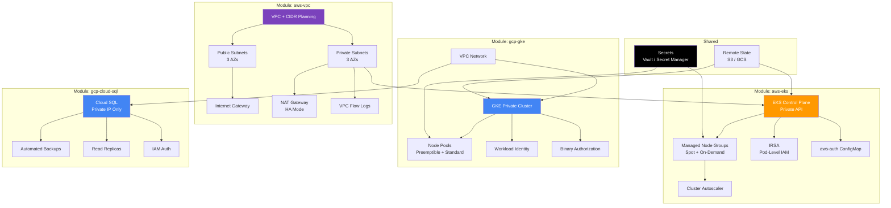

<div align="center">

# Terraform Modules — EKS, GKE, VPC

**Production-ready Terraform modules for AWS and GCP, built from real enterprise deployments**

[](https://www.terraform.io/)
[](https://aws.amazon.com/)
[](https://cloud.google.com/)
[](LICENSE)
[](https://devopsdispatch.beehiiv.com)

*Extracted from 12 years of cloud migrations for banks, telecoms, and government across MENA.*

</div>

---

## The Problem

Terraform's official modules are too generic. Community modules are too opinionated. You end up writing custom modules from scratch every time — then maintaining them alone.

These modules come from real enterprise deployments. They handle the edge cases the docs don't mention: private networking, IAM least-privilege, encryption at rest, and multi-environment promotion.

---

## Architecture Overview



---

## Modules

| Module | Cloud | Description | Status |
|--------|-------|-------------|--------|
| `aws-vpc` | AWS | VPC with public/private subnets, NAT, flow logs | Stable |
| `aws-eks` | AWS | EKS cluster with managed node groups, IRSA, autoscaling | Stable |
| `gcp-gke` | GCP | GKE private cluster with Workload Identity | Stable |
| `gcp-cloud-sql` | GCP | Cloud SQL (PostgreSQL/MySQL) with private networking | Stable |
| `gcp-vpc` | GCP | VPC with subnets, Cloud NAT, firewall rules | Stable |
| `aws-ecr` | AWS | ECR repositories with lifecycle policies | Stable |

---

## Quick Start

### 1. Use a module directly from GitHub

```hcl
module "eks" {
  source = "github.com/maziz00/terraform-modules//modules/aws-eks?ref=v1.0.0"

  cluster_name       = "production"
  cluster_version    = "1.29"
  vpc_id             = module.vpc.vpc_id
  private_subnet_ids = module.vpc.private_subnet_ids

  node_groups = {
    general = {
      instance_types = ["m5.xlarge"]
      min_size       = 2
      max_size       = 10
      desired_size   = 3
    }
    spot = {
      instance_types = ["m5.xlarge", "m5a.xlarge", "m5d.xlarge"]
      capacity_type  = "SPOT"
      min_size       = 0
      max_size       = 20
      desired_size   = 2
    }
  }

  tags = {
    Environment = "production"
    ManagedBy   = "terraform"
  }
}
```

### 2. Or clone and customize

```bash
git clone https://github.com/maziz00/terraform-modules.git
cd terraform-modules/modules/aws-eks

# Check the example
cat examples/complete/main.tf

# Initialize and plan
cd examples/complete
terraform init
terraform plan
```

---

## Module: aws-eks — Highlights

What makes this different from `terraform-aws-modules/eks`:

- **Private API endpoint** by default — no public cluster access
- **Mixed node groups** — Spot + On-Demand in the same cluster with priority-based scheduling
- **IRSA baked in** — IAM Roles for Service Accounts configured out of the box
- **Cluster Autoscaler ready** — IAM policy and service account created automatically
- **aws-auth managed** — no manual `kubectl edit configmap` post-deploy
- **Encryption at rest** — KMS envelope encryption for etcd secrets

## Module: gcp-gke — Highlights

- **Private cluster** with authorized networks — no public nodes
- **Workload Identity** enabled by default (no node-level service accounts)
- **Binary Authorization** policy support for container image verification
- **Preemptible + standard node pools** for cost optimization
- **Shielded nodes** with Secure Boot and vTPM

---

## Project Structure

```
terraform-modules/
├── modules/
│   ├── aws-vpc/
│   │   ├── main.tf
│   │   ├── variables.tf
│   │   ├── outputs.tf
│   │   ├── versions.tf
│   │   └── examples/
│   │       └── complete/
│   ├── aws-eks/
│   │   ├── main.tf
│   │   ├── variables.tf
│   │   ├── outputs.tf
│   │   ├── versions.tf
│   │   ├── iam.tf
│   │   ├── node-groups.tf
│   │   └── examples/
│   │       ├── basic/
│   │       └── complete/
│   ├── gcp-gke/
│   │   ├── main.tf
│   │   ├── variables.tf
│   │   ├── outputs.tf
│   │   ├── versions.tf
│   │   └── examples/
│   │       └── complete/
│   ├── gcp-cloud-sql/
│   │   ├── main.tf
│   │   ├── variables.tf
│   │   ├── outputs.tf
│   │   ├── versions.tf
│   │   └── examples/
│   │       └── complete/
│   ├── gcp-vpc/
│   └── aws-ecr/
├── LICENSE
└── README.md
```

---

## Design Principles

1. **Every variable has a `description`** — no guessing what inputs mean
2. **Every module has `examples/`** — working code, not just docs
3. **Sensible defaults** — secure out of the box, customize when needed
4. **No provider blocks in modules** — the caller controls provider configuration
5. **Pinned provider versions** — no surprise breaking changes

---

## Requirements

| Tool | Version |
|------|---------|
| Terraform | >= 1.5.0 |
| AWS Provider | >= 5.0 |
| Google Provider | >= 5.0 |

---

## Author

**Mohamed AbdelAziz** — Senior DevOps Architect, CKA/CKAD/AWS SA
12 years building cloud infrastructure for MENA enterprises.

- [LinkedIn](https://www.linkedin.com/in/maziz00/) | [Medium](https://medium.com/@maziz00) | [Upwork](https://www.upwork.com/freelancers/maziz00)

---

## License

MIT — use freely. Star the repo if it saved you time.
